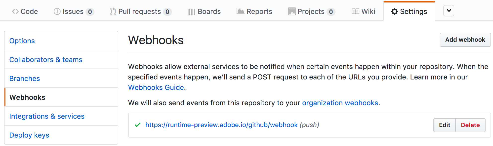
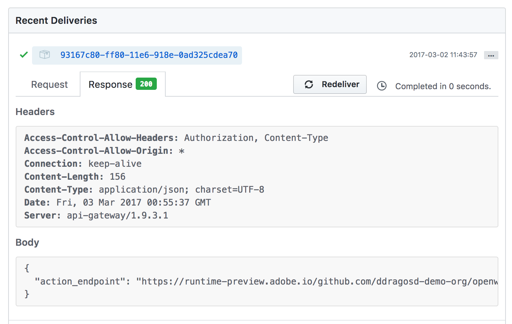
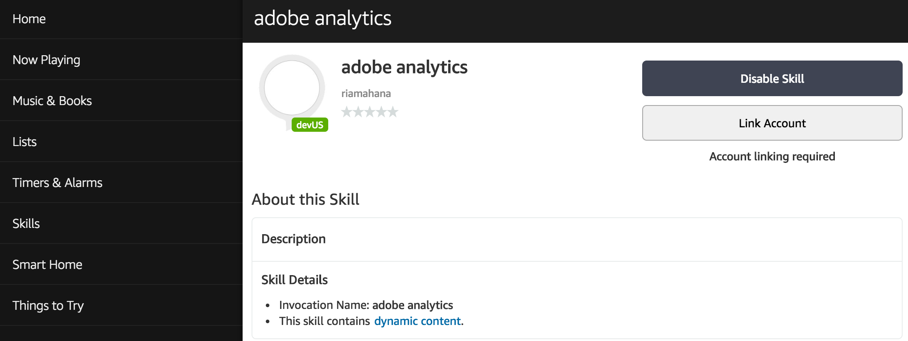

##### Table of Contents
[Setting up](#setting-up)
  * [Set up an action in Adobe I/O Runtime](#set-up-an-action-in-adobe-io-runtime)
  * [Connect the action with an Amazon Alexa skill](#setup-an-amazon-alexa-skill)

[Send the first voice command to your skill](#send-the-first-voice-command-to-your skill)


# Setting up

:clock3:  ~ `15 minutes`

## Set up an action in Adobe I/O Runtime

1. Login or Create an Account on [GitHub](https://github.com)
2. Fork the repository used for the lab from:
    https://github.com/adobe-apiplatform/adobeio-runtime-lab-analytics

    > :bulb: Make sure the repository is public

3. ##### Configure a new webhook
   Visit your new repo and go to `Settings` > `Webhooks` > `Add webhook`

   Configure the new webhook with the following information:

   Field | Value
   ------------ | -------------
   Payload URL | `https://runtime-preview.adobe.io/github/webhook`
   Content type | _application/json_
   Secret | _( provided during the lab )_
   Which events would you like to trigger this webhook? | _Just the push event._

   

   When done click the `Add webhook` button.

   

   Once the webhook is saved you should see it listed.

4. ##### Retrieve the URL for your action.
    Click the `Edit` button to go back into the webhook edit screen in order to get the URL to your action.
  Scroll down to see the `Recent deliveries`.
   and click on the `...` button or the UID to open the details.
  
  The `Response` Tab should indicate a `200` Response with a Body containing the  `action_endpoint`.

:boom: Congratulations ! At this point your code is deployed in the Adobe I/O Runtime. Let's go ahead and invoke this action with Amazon Alexa.

> :bulb: Make a note of the `action_endpoint` value as you need it in the next step.

## Setup an Amazon Alexa Skill 

1. Login to Amazon Developer Portal at https://developer.amazon.com/

   > :bulb: The lab should have provided you with access credentials.

2. Select the `Alexa` tab and then click on `Get Started` in Alexa Skill Kit box.
    

3. Your Amazon developer account provided for the lab is most likely setup with the `Adobe Analytics Skill` under `You skills` tab.  In this case you can fast forward to step #6 or read below how to configure a new skill.

4. ##### Setup general skill info
  
    * The `Name` field should contain something unique.
    * `Invocation name` is what Alexa uses to start the Skill; for example if the skill is named `Adobe Analytics` you would say _Use Adobe Analytics_ to activate the skill.
    * The global fields can be left with the default value

5. ##### Setup an interaction model
    

    * Paste in the intent schema from [IntentSchema.json](./IntentSchema.json)

    * Create a custom slot for each of the items in [./customSlotTypes](./customSlotTypes). Click `Add Slot Type` and enter a `Type` and the associated `Values` similar to the screenshot bellow:
    

    * Paste in sample utterances from [SampleUtterances.txt](./SampleUtterances.txt) inside the `Sample utterances` text area.

    > To learn more about Alexa's interaction model see https://developer.amazon.com/public/solutions/alexa/alexa-skills-kit/docs/alexa-skills-kit-interaction-model-reference

6. ##### Link the Alexa skill with your GitHub code deployed in the Adobe I/O Runtime
   Click the `Configuration` option on the left side menu to see something similar to the screenshot below:
    

    * ##### Service Endpoint

      Paste here the value you got after setting up the GitHub webhook to [ Retrieve the URL for your action](#Retrieve-the-URL-for-your-action)
      ```
      https://runtime-preview.adobe.io/<...>
      ```

      > :bulb: Alexa will invoke this URL on each interaction with an end-user.

7. ##### :id: Allow users to authenticate with their Adobe ID
    This step connects an Alexa user with a user in Adobe's Marketing Cloud. This Adobe ID will be used to extract data from Adobe Analytics. For this the skill needs to be instructed how to authenticate users.

    

    * Set the Authorization URL to:
      ```
      https://ims-na1.adobelogin.com/ims/authorize/v1
      ```

    * Set the Client ID to the value provided during the lab.

    * Add the following domains to the list
      ```
      ims-na1.adobelogin.com

      adobeid-na1.services.adobe.com
      ```

    * In the scopes field add:
      ```
      openid,AdobeID,read_organizations,additional_info.projectedProductContext,additional_info.job_function,session
      ```
      These scopes are needed to pull data out from Marketing Cloud, Adobe Analytics.

    * Set Authorization Grant type to Implicit

:clap: You are now ready to use this skill. In the next chapter you will learn how to test it and enhance it.

# Send the first voice command to your skill

:clock3:  ~ `15 minutes`

You're almost ready to make the first voice command. At this stage you're acting as any end user that is installing the skill. You'll be going through the same experience.

### Decide how you want to interact with Alexa

There are several ways to interact with Alexa:

1. ##### Using the Browser
  * Using the `Test` tab on the page you set up the Amazon Alexa Skill.

2. ##### Using a Mobile app
    * iOS  - Install [Reverb for Amazon Alexa](https://itunes.apple.com/bt/app/reverb.ai/id1144695621?mt=8)
    * Android - Install [Reverb for Amazon Alexa](https://play.google.com/store/apps/details?id=agency.rain.android.alexa&hl=en)

    > Once you open the mobile app use the access credentials provided during the lab to login.

3. ##### Using an Amazon Alexa device
    This is out of scope for this lab.

### Enable the skill

Open the browser to: https://alexa.amazon.com .
> Use the same credentials used to setup the Amazon Alexa skill.

On the left side menu click on `Skills`, then click `Your skills` link on top of the page. You should see a list with your skills:


Click on `Adobe Analytics skill` to open it.


## Link Amazon Alexa with Adobe

The first thing end users should see after installing this skill is a screen telling them that Account Linking is required.



Click on `Enable` button and login using an Adobe ID.The browser should redirect you now to Adobe's login page.
> You should use the Adobe ID provided during the lab.


Once login is successful with Adobe Alexa should confirm that with a message similar to the one in the screenshot below.


To complete this section move on to Exercise 1.
