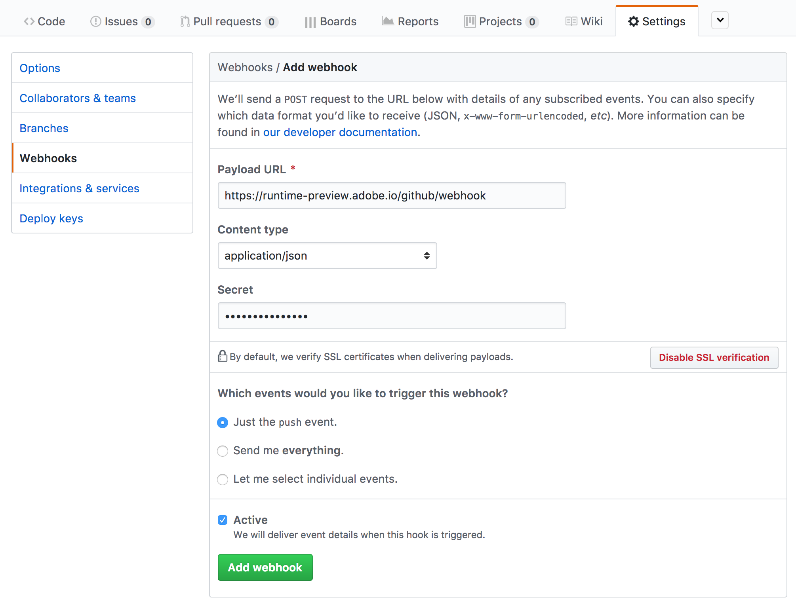
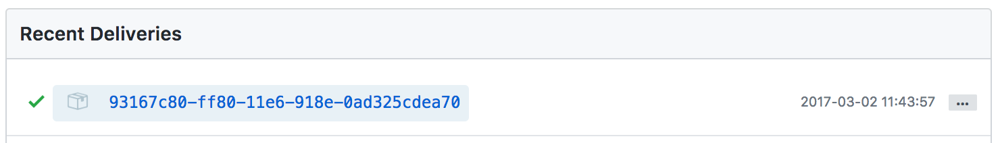
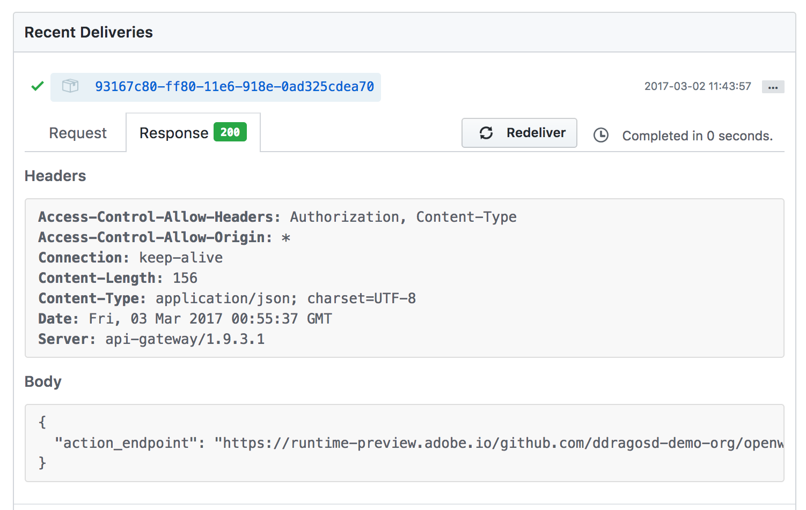
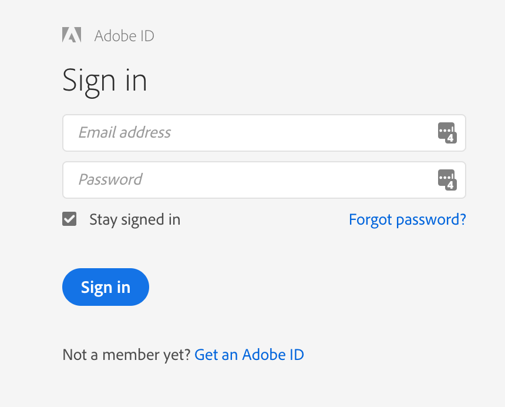
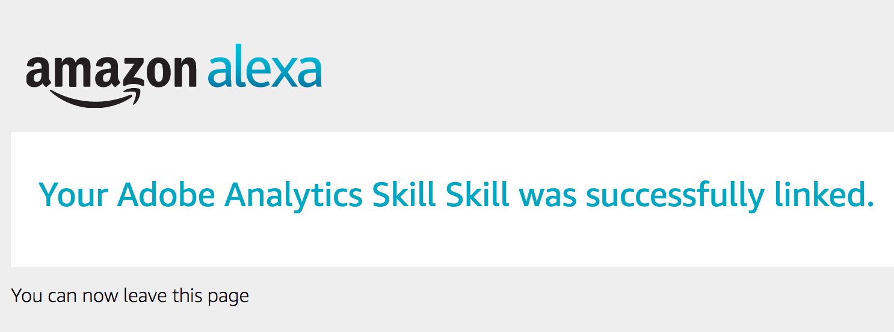

# Setting up

In this section you'll complete 3 steps:

  * [Set up an action in Adobe I/O Runtime](#set-up-an-action-in-adobe-io-runtime)
  * [Retrieve the URL for your action](#retrieve-the-url-for-your-action)
  * [Connect the action with an Amazon Alexa skill](#setup-an-amazon-alexa-skill)
  

~ `15 minutes`

## Set up an action in Adobe I/O Runtime

1. Login or Create an Account on [GitHub](https://github.com)
2. Fork the repository used for the lab from:
    https://github.com/adobe-apiplatform/adobeio-runtime-lab-analytics

    > :bulb: Make sure the repository is public

3. ##### Configure a new webhook

   In this step you'll deploy your own code into Adobe I/O Runtime so that you can respond to Alexa voice commands and extract data from Adobe Analytics in response.

   Visit your new repo and go to `Settings` > `Webhooks` > `Add webhook`
   
   

   Configure the new webhook with the following information:

Field        |    Value
------------ | -------------
Payload URL  | `https://runtime-preview.adobe.io/github/webhook`
Content type | _application/json_
Secret       | _( provided during the lab )_
Which events would you like to trigger this webhook? | _Just the push event._

   When done, click the `Add webhook` button. Once the webhook is saved, you should see it listed.

   
   
## Retrieve the URL for your action.

  Click the `Edit` button to go back into the webhook edit screen in order to get the URL to your action.

  Scroll down to see the `Recent deliveries` and click on the `...` button or the UID to open the details.

  

  The `Response` Tab should indicate a `200` Response with a Body containing the  `action_endpoint`.

  > :bulb: Save the value of the `action_endpoint` field as you need it in the next step.

  

:boom: Congratulations ! At this point your code is deployed in the Adobe I/O Runtime. Let's go ahead and invoke this action with Amazon Alexa.

Click on `Enable` button and login using an Adobe ID.The browser should redirect you now to Adobe's login page.
> You should use the Adobe ID provided during the lab.

Once login is successful with Adobe, Alexa should confirm it with a message similar to the one in the screenshot below.

To complete this section move on to Exercise 1.
