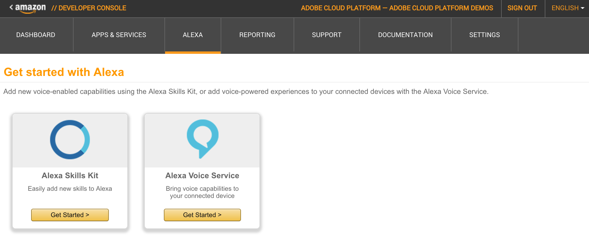

# Setting up

In this section you'll complete a few steps:

  * [Set up an action in Adobe I/O Runtime](#set-up-an-action-in-adobe-io-runtime)
  * [Retrieve the URL for your action](#retrieve-the-url-for-your-action)
  * [Setup an Amazon Alexa Skill](#setup-an-amazon-alexa-skill)
  * [Connect the action with an Amazon Alexa skill](#setup-an-amazon-alexa-skill)
  

~ `15 minutes`

## Set up an action in Adobe I/O Runtime

1. Login or Create an Account on [GitHub](https://github.com)
2. Fork the repository used for the lab from:
    https://github.com/adobe-apiplatform/adobeio-runtime-lab-analytics

    > :bulb: Make sure the repository is public

3. ##### Configure a new webhook

   In this step you'll deploy your own code into Adobe I/O Runtime so that you can respond to Alexa voice commands and extract data from Adobe Analytics in response.

   Visit your new repo and go to `Settings` > `Webhooks` > `Add webhook`
   
   

   Configure the new webhook with the following information:

Field        |    Value
------------ | -------------
Payload URL  | `https://runtime-preview.adobe.io/github/webhook`
Content type | _application/json_
Secret       | _( provided during the lab )_
Which events would you like to trigger this webhook? | _Just the push event._

   When done, click the `Add webhook` button. Once the webhook is saved, you should see it listed.

   
   
## Retrieve the URL for your action.

  Click the `Edit` button to go back into the webhook edit screen in order to get the URL to your action.

  Scroll down to see the `Recent deliveries` and click on the `...` button or the UID to open the details.

  

  The `Response` Tab should indicate a `200` Response with a Body containing the  `action_endpoint`.

  > :bulb: Save the value of the `action_endpoint` field as you need it in the next step.

  


:boom: Congratulations ! At this point your code is deployed in the Adobe I/O Runtime. Let's go ahead and invoke this action with Amazon Alexa.

## Setup an Amazon Alexa Skill 

1. Login to Amazon Developer Portal at https://developer.amazon.com/

   > :bulb: The lab should have provided you with access credentials.

2. Select the `Alexa` tab and then click on `Get Started` in Alexa Skill Kit box.

  

3. Your Amazon developer account provided for the lab is most likely setup with the `Adobe Analytics Skill` under `You skills` tab.  In this case you can fast forward to step #6 or read below for on overview on how to configure a new skill.

4. ##### Setup general skill info
  * The `Name` field should contain something unique.
  * `Invocation name` is what Alexa uses to start the Skill; for example if the invocation name is `Adobe Analytics` you should say _Use Adobe Analytics_ to activate the skill.
  * The global fields can be left with the default value

  

5. ##### Setup an interaction model
   * Paste in the intent schema from [IntentSchema.json](./IntentSchema.json)

  ```json
{  "intents": [{
      "intent": "OneshotReportIntent",
      "slots": [
        {          "name": "Metric",     "type": "LIST_OF_METRICS"    },
        {          "name": "Duration",   "type": "LIST_OF_DURATIONS"  }
      ]
    },{
      "intent": "ReportSuiteSelectionIntent",
      "slots": [
        {          "name": "ReportSuite",  "type": "AMAZON.LITERAL"   }
      ]
    },
    {      "intent": "PageViewsTodayIntent" },
    {      "intent": "ThankYouIntent"       },
    {      "intent": "AMAZON.HelpIntent"    },
    {      "intent": "AMAZON.StopIntent"    },
    {      "intent": "AMAZON.CancelIntent"  }
  ]}
  ```
    

  * Create a custom slot for each of the items in [./customSlotTypes](./customSlotTypes) folder.
      * Click `Add Slot Type` and enter a `Type` and the associated `Values` similar to the screenshot bellow with `LIST_OF_DURATIONS` Type.
      * Then add another slot type called `LIST_OF_METRICS` from [./customSlotTypes](./customSlotTypes).

      

  * In `Sample utterances` text area paste the sample utterances from [SampleUtterances.txt](./SampleUtterances.txt) file.

    > Optionally if you want to learn more about Alexa's interaction model see https://developer.amazon.com/public/solutions/alexa/alexa-skills-kit/docs/alexa-skills-kit-interaction-model-reference
    

Click on `Enable` button and login using an Adobe ID.The browser should redirect you now to Adobe's login page.
> You should use the Adobe ID provided during the lab.


Once login is successful with Adobe, Alexa should confirm it with a message similar to the one in the screenshot below.


To complete this section move on to Exercise 1.
